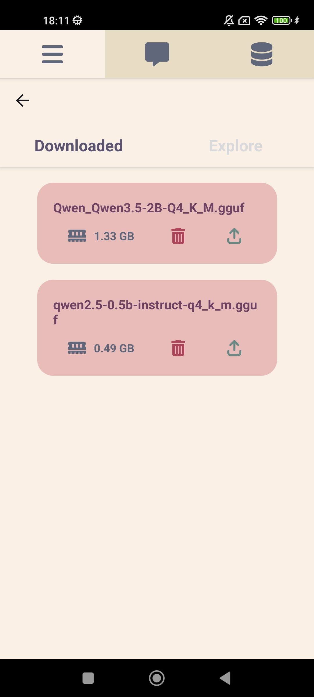
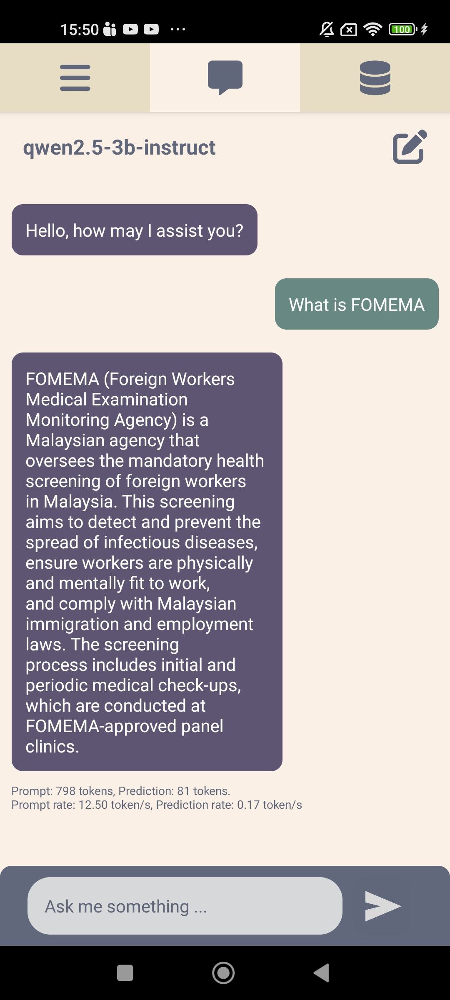
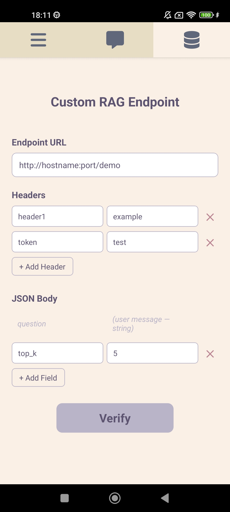
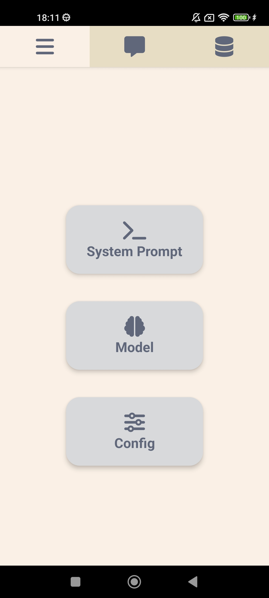
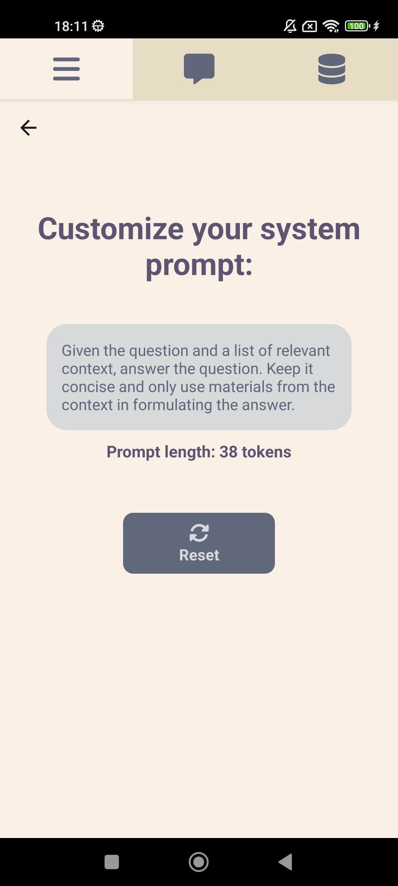
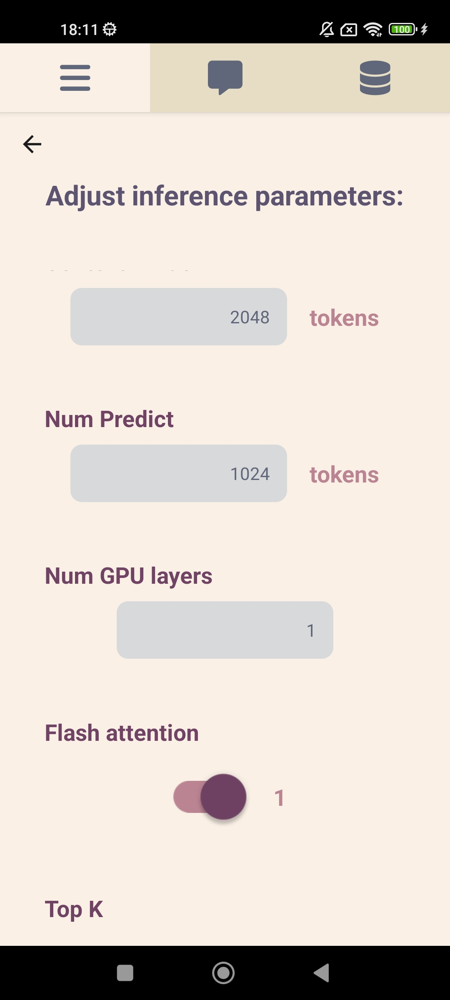
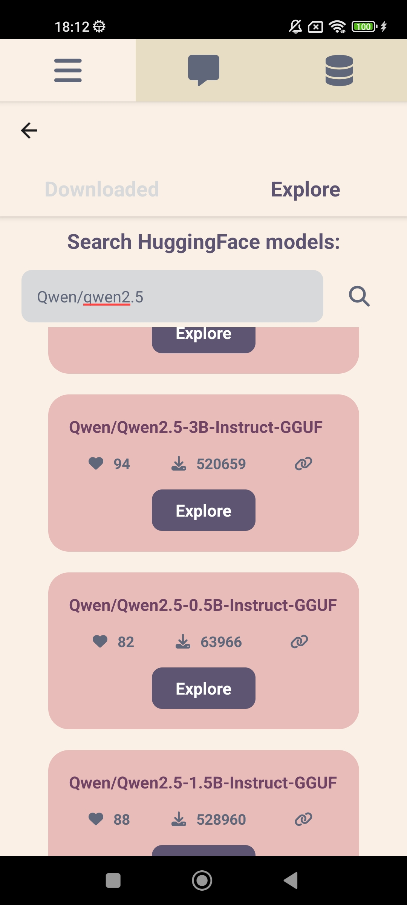

# Pocket-RAG

A React Native mobile application that runs a Small Language Model (SLM) entirely on-device and augments its responses with context retrieved from a custom RAG (Retrieval-Augmented Generation) API endpoint.

## Overview

Most AI chatbot apps rely on cloud inference. This app takes a different approach — the language model runs locally on your Android or iOS device using [llama.rn](https://github.com/mybigday/llama.rn), with no data sent to any LLM provider. A separate RAG server (which you host or connect to) is called to retrieve relevant context before each inference, grounding the model's responses in your own knowledge base.

**Demo**

<p align="center">
  
  
  
  
</p>
<p align="center">
  
  
  
</p>

**Typical flow:**
1. User sends a message
2. App calls your RAG endpoint with the question → receives relevant context
3. Context + question are combined into a prompt
4. The on-device SLM generates a response via llama.rn

---

## Features

- **On-device inference** — runs GGUF-format models locally via llama.rn; no cloud LLM calls
- **RAG integration** — connects to any HTTP RAG endpoint; fully configurable URL, headers, and request body
- **Model management** — search and download GGUF models directly from Hugging Face, or load models already on-device
- **Customisable system prompt** — edit the instruction prompt that shapes the assistant's behaviour
- **Inference parameter tuning** — adjust temperature, top-k, top-p, context length, GPU layers, and more from within the app
- **Persistent settings** — RAG endpoint configuration is saved across app restarts

---

## Prerequisites

Before building, complete the [React Native environment setup](https://reactnative.dev/docs/environment-setup) for your target platform (Android / iOS).

Required tools:
- Node.js >= 18
- JDK 17 (Android)
- Android SDK / Xcode (iOS)

---

## Installation

```bash
# 1. Clone the repository
git clone <repo-url>
cd SLM_RAG_Chatbot

# 2. Install JS dependencies
npm install

# 3. (iOS only) Install CocoaPods
cd ios && pod install && cd ..
```

---

## Running the App

### Start Metro

```bash
npm start
```

### Android

```bash
npm run android
```

### iOS

```bash
npm run ios
```

---

## App Navigation

The app has three main tabs at the bottom of the screen:

| Icon | Tab | Description |
|------|-----|-------------|
| Bars | **Menu** | Access system prompt, model, and config settings |
| Message | **Chat** | Main chat interface |
| Database | **Database** | Configure your RAG endpoint |

### Menu > System Prompt
Edit the instruction given to the model before every conversation. The default prompt instructs the model to answer concisely using only the retrieved context. A token count estimate is shown as you type.

### Menu > Model
Two sub-tabs:

- **Downloaded** — lists GGUF models stored on-device. Tap a model to load it into memory. Loaded model name is shown in the chat header.
- **Explore** — search Hugging Face for GGUF models by keyword. Tap a result to view files and download.

### Menu > Config
Sliders and toggles for llama.rn inference parameters:

| Parameter | Description |
|-----------|-------------|
| Context Length (`n_ctx`) | Token window size for the model |
| GPU Layers (`n_gpu_layers`) | Layers offloaded to GPU (0 = CPU only) |
| Flash Attention | Enables flash attention (faster, less memory) |
| Max Tokens (`n_predict`) | Maximum tokens to generate per response |
| Temperature | Randomness of output (0 = deterministic) |
| Top-K / Top-P / Min-P | Sampling filters |
| Repeat Penalty | Penalises repeated tokens |
| Mirostat | Adaptive sampling mode (0 = off) |
| RAG Top-K / Top-N | Passed to the RAG endpoint if your API uses them |

### Database Tab
Configure the RAG API endpoint the app calls before each inference.

**Endpoint URL** — the full URL including host and port, e.g. `http://192.168.1.10:8000/rag`

**Headers** — add any HTTP headers required by your API (e.g. `Authorization: Bearer <token>`). Use the `+ Add Header` button to add key-value pairs.

**JSON Body** — the request body sent to your endpoint. The `question` field is always included automatically (it contains the user's message). Add any additional constant fields your API requires (e.g. `top_k: 4`) using `+ Add Field`. Numeric strings are automatically parsed as numbers.

Press **Verify** to test the connection with a `"test"` question before using the chat.

Settings are saved automatically and restored on next launch.

---

## RAG Endpoint Contract

Your RAG server must accept a `POST` request and return a JSON response containing a `context` field:

**Request**
```json
{
  "question": "What is the capital of France?",
  "your_custom_field": "your_value"
}
```

**Response**
```json
{
  "context": "France is a country in Western Europe. Its capital city is Paris..."
}
```

The retrieved `context` is injected into the prompt alongside the user's question before local inference runs.

---

## Project Structure

```
SLM_RAG_Chatbot/
├── App.tsx                   # Navigation setup and root provider
├── state/
│   └── state.tsx             # Global app state (React Context)
├── screen/
│   ├── chat.tsx              # Chat UI and inference logic
│   ├── database.tsx          # RAG endpoint configuration screen
│   ├── config.tsx            # Inference parameter settings
│   ├── prompt.tsx            # System prompt editor
│   ├── downloaded.tsx        # On-device model list
│   └── explore.tsx           # Hugging Face model search
└── components/
    ├── button/               # CButton, SliderBar, ToggleSwitch
    ├── textbox/              # TextArea
    ├── message/              # MessageBox (chat bubbles)
    ├── modal/                # Hugging Face download modal
    └── model/                # llama.rn init, HF API helpers
```

---

## Key Dependencies

| Package | Purpose |
|---------|---------|
| `llama.rn` | On-device GGUF model inference |
| `@dr.pogodin/react-native-fs` | File system access (model storage, settings persistence) |
| `axios` | HTTP calls to the RAG endpoint |
| `@react-navigation/native` | Screen navigation |
| `react-native-paper` | Segmented button UI component |

---

## Troubleshooting

**App crashes on model load** — ensure the model file is a valid GGUF format. Very large models may exceed device RAM; try a smaller quantisation (e.g. Q4_K_M instead of Q8).

**RAG endpoint returns 422** — your API's Pydantic model likely does not expect the fields being sent. Use the Database screen to configure only the fields your API accepts. The `question` field is always required.

**No response / connection error** — check that the device and the RAG server are on the same network and that the port is not blocked by a firewall. Use the **Verify** button to diagnose before chatting.

**Model not appearing in Downloaded tab** — pull down to refresh, or toggle to another tab and back. The list reads from the device filesystem on each mount.
